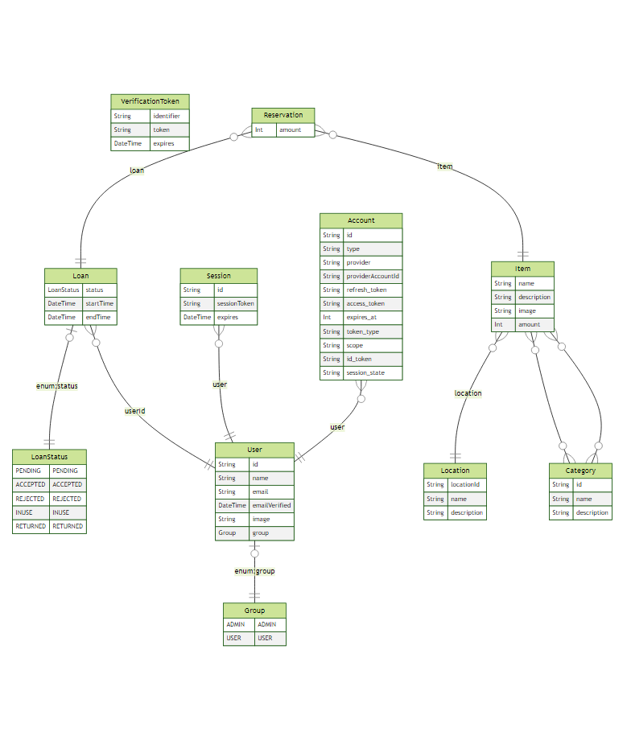

# Klapi

Klapi is a web-based application to manage simple equipment reserve/loan/return transactions.

## Stack

Klapi consists of the following components:

- [Next.js](https://nextjs.org)
- [Prisma](https://www.prisma.io)
- [NextAuth.js](https://next-auth.js.org/)
- [Docker](https://www.docker.com)
- [PostgreSQL](https://www.postgresql.org)
- [Chakra UI](https://chakra-ui.com)

## Development

1. Run database with docker-compose:

```
docker-compose up -d
```

2. Run development server:

```
yarn dev
```

Project management is done with GitHub Projects.

### Database schema

New schema diagram is generated every time when generating new Prisma Client.



### Prisma

Klapi uses Prisma as ORM provider to connect Next.js to the database. Database schema is defined in `prisma/schema.prisma`. After making changes to the schema, remember to run `yarn prisma migrate dev`.

To generate dummy data, run `yarn prisma db seed`. The data is defined in `prisma/seed.ts`.

More information about Prisma can be found [here](https://www.prisma.io/docs/concepts/overview/what-is-prisma).

### Authentication

Klapi uses NextAuth.js for authentication. Currently only authentication with Google is supported. New authentication providers can be added in NextAuth.js API route. If needed, Google authentication provider can be configured to only allow users from specific domains (own organization).

Klapi has 2 user roles: admin and user. Any person with Google account can become an user. Users can browse equipment and send reservation requests, as well as see their reservation history. Admins can edit equipment catalog, manage users and approve/reject reservation requests.
