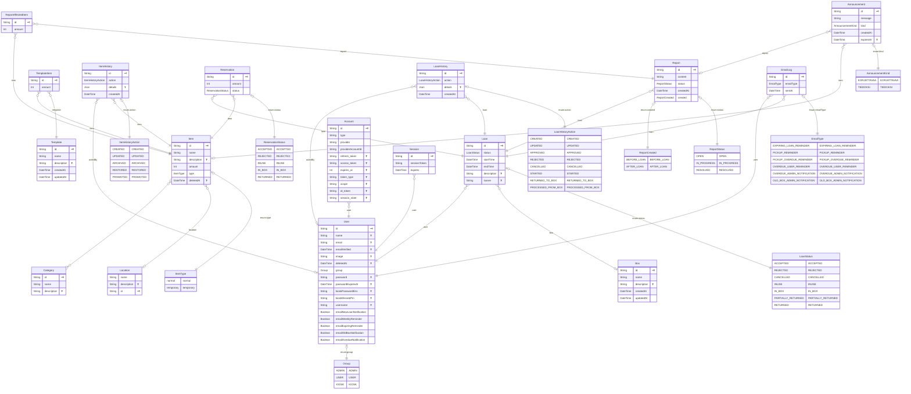

# Klapi

A web-based equipment loan management system for organizations. Browse inventory, request loans, and manage returns with automated email notifications.

## Features

- Browse equipment catalog with search and filtering
- Request loans with flexible date ranges
- Automated email notifications for loan reminders and updates
- Admin dashboard for managing inventory, locations, and loans
- Multi-user support with role-based permissions (Admin, User, Kiosk)
- Support for normal and temporary items
- Organized inventory with categories, locations, and boxes

## Workflows

### For Users

1. Browse available equipment in the catalog
2. Request a loan by selecting dates and items
3. Receive an email confirmation right away — requests are accepted
   automatically, there is no approval queue to wait for
4. Get automated reminders before pickup, and when a loan runs late
5. Return items and view loan history

### For Admins

1. Manage equipment catalog (add, edit, remove items)
2. Organize items by categories, locations, and boxes
3. Track all active and past loans; reject or cancel ones that shouldn't run
   (rejecting is after the fact — see the note on automatic acceptance above)
4. Handle returns, including items dropped into a return box
5. Manage user accounts and permissions

### For Kiosk Mode

- Self-service stations for quick item checkout and returns
- Simplified interface for public access points

## Tech Stack

- [Next.js 16](https://nextjs.org) (App Router) — React framework
- [React 19](https://react.dev) with TypeScript (strict)
- [Prisma 7](https://www.prisma.io) — Database ORM
- [PostgreSQL](https://www.postgresql.org) — Database
- [Auth.js / next-auth v5](https://authjs.dev/) — Authentication
- [Tailwind CSS 4](https://tailwindcss.com) — Utility-first styling (CSS-first config)
- [shadcn/ui](https://ui.shadcn.com) — Component primitives (owned in `components/ui/`)
- [Radix UI](https://www.radix-ui.com) — Unstyled accessible primitives (Dialog, Switch, Tooltip, Label)
- [next-themes](https://github.com/pacocoursey/next-themes) — Dark mode (class-based)
- [sonner](https://sonner.emilkowal.ski/) — Toast notifications
- [react-select](https://react-select.com/) — Creatable/multi selects (shadcn-styled wrapper)
- [lucide-react](https://lucide.dev/) — Icons
- [SWR](https://swr.vercel.app/) — Client-side data fetching
- [AWS SES](https://aws.amazon.com/ses/) — Email notifications

## UI & theming

- All UI primitives live in `components/ui/` — they're source files you own and edit freely (shadcn pattern, not an installed library).
- Design tokens are CSS variables in `styles/globals.css`. Colors map to HSL vars (`--primary`, `--background`, `--card`, `--destructive`, `--success`, `--warning`, etc.) with `.dark` overrides.
- There is no `tailwind.config.ts` — Tailwind 4 is configured CSS-first. `styles/globals.css` does `@import 'tailwindcss'` and exposes the tokens through an `@theme` block, which is what makes `bg-primary`, `text-muted-foreground` etc. work. PostCSS wires it up via `@tailwindcss/postcss` in `postcss.config.js`. Dark mode is class-based — toggled by `next-themes` via the `class` attribute on `<html>`.
- Toasts use `sonner`. Import `toast` from `sonner` and call `toast.success(...)`, `toast.error(...)`, `toast.warning(...)`.
- Creatable selects use the `CreatableSelect` wrapper in `components/ui/creatable-select.tsx` — it styles `react-select`'s creatable via the `classNames` API so it respects dark mode and tokens without runtime theme juggling.

## Development

1. Install dependencies:

```bash
pnpm install
```

2. Set up environment variables:

```bash
cp .env.example .env
```

The defaults in `.env.example` match `docker-compose.yml`, so the database
works out of the box; the AWS and Google values are only needed for real email,
photo uploads, and Google sign-in.

3. Start local database:

```bash
docker-compose up -d
```

4. Run migrations and seed data:

```bash
pnpm prisma migrate dev
pnpm prisma db seed
```

5. Start development server (also boots the local SES mock automatically):

```bash
pnpm dev
```

Visit [http://localhost:3000](http://localhost:3000).

### Useful scripts

- `pnpm dev` — Next dev server + local SES mock
- `pnpm build` — `prisma migrate deploy` + `next build`
- `pnpm start` — Production server
- `pnpm type-check` — `tsc --noEmit`
- `pnpm lint` — ESLint (Next config)
- `pnpm test` — Vitest against a disposable Postgres (docker-compose)
- `pnpm test:ci` — Vitest without docker (expects `DATABASE_URL` already set)

## Local Email Testing

The dev script starts [aws-ses-v2-local](https://github.com/domdomegg/aws-ses-v2-local) in parallel. All emails are captured instead of being sent.

Open the email viewer at [http://localhost:8005](http://localhost:8005) to see sent emails.

To review the templates without triggering the flows that send them:

```bash
pnpm tsx scripts/preview-emails.ts
```

It renders every template with sample data — no app or database needed — to
`/tmp/klapi-emails/`, with an `index.html` linking them all.

## Database

Schema is defined in [prisma/schema.prisma](prisma/schema.prisma). After schema changes:

```bash
pnpm prisma migrate dev --name description_of_change
```

Generate test data:

```bash
pnpm prisma db seed
```

### Entity-relationship diagram

The diagram below is generated from [prisma/schema.prisma](prisma/schema.prisma)
by `prisma-erd-generator`. Refresh it after a schema change with:

```bash
pnpm erd
```

That regenerates the mermaid source into `.erd.md` (gitignored) and splices it
between the markers below. Markdown output is pure text generation, so it costs
~25 ms — the `.pdf`/`.svg`/`.png` output modes are the expensive ones, because
they rasterize through a headless Chrome that `puppeteer` has to download first.
Don't switch the generator's `output` to one of those.

<!-- ERD:START -->


```mermaid
erDiagram

        ItemHistoryAction {
            CREATED CREATED
UPDATED UPDATED
ARCHIVED ARCHIVED
RESTORED RESTORED
PROMOTED PROMOTED
        }
    


        AnnouncementKind {
            KORJATTAVAA KORJATTAVAA
TIEDOKSI TIEDOKSI
        }
    


        LoanHistoryAction {
            CREATED CREATED
UPDATED UPDATED
APPROVED APPROVED
REJECTED REJECTED
CANCELLED CANCELLED
STARTED STARTED
RETURNED_TO_BOX RETURNED_TO_BOX
PROCESSED_FROM_BOX PROCESSED_FROM_BOX
        }
    


        Group {
            ADMIN ADMIN
USER USER
KIOSK KIOSK
        }
    


        ItemType {
            normal normal
temporary temporary
        }
    


        ReportStatus {
            OPEN OPEN
IN_PROGRESS IN_PROGRESS
RESOLVED RESOLVED
        }
    


        ReportCreated {
            BEFORE_LOAN BEFORE_LOAN
AFTER_LOAN AFTER_LOAN
        }
    


        LoanStatus {
            ACCEPTED ACCEPTED
REJECTED REJECTED
CANCELLED CANCELLED
INUSE INUSE
IN_BOX IN_BOX
PARTIALLY_RETURNED PARTIALLY_RETURNED
RETURNED RETURNED
        }
    


        ReservationStatus {
            ACCEPTED ACCEPTED
REJECTED REJECTED
INUSE INUSE
IN_BOX IN_BOX
RETURNED RETURNED
        }
    


        EmailType {
            EXPIRING_LOAN_REMINDER EXPIRING_LOAN_REMINDER
PICKUP_REMINDER PICKUP_REMINDER
PICKUP_OVERDUE_REMINDER PICKUP_OVERDUE_REMINDER
OVERDUE_USER_REMINDER OVERDUE_USER_REMINDER
OVERDUE_ADMIN_NOTIFICATION OVERDUE_ADMIN_NOTIFICATION
OLD_BOX_ADMIN_NOTIFICATION OLD_BOX_ADMIN_NOTIFICATION
        }
    
  "Account" {
    String id "🗝️"
    String type 
    String provider 
    String providerAccountId 
    String refresh_token "❓"
    String access_token "❓"
    Int expires_at "❓"
    String token_type "❓"
    String scope "❓"
    String id_token "❓"
    String session_state "❓"
    }
  

  "Session" {
    String id "🗝️"
    String sessionToken 
    DateTime expires 
    }
  

  "User" {
    String id "🗝️"
    String name "❓"
    String email "❓"
    DateTime emailVerified "❓"
    String image "❓"
    DateTime deletedAt "❓"
    Group group 
    String password "❓"
    DateTime passwordExpiresAt "❓"
    String kioskPasswordEnc "❓"
    String kioskElevatePin "❓"
    String username "❓"
    Boolean emailNewLoanNotification 
    Boolean emailWeeklyReminder 
    Boolean emailExpiringReminder 
    Boolean emailOldBoxNotification 
    Boolean emailOverdueNotification 
    }
  

  "Item" {
    String id "🗝️"
    String name 
    String description "❓"
    Int amount 
    ItemType type 
    DateTime deletedAt "❓"
    }
  

  "Template" {
    String id "🗝️"
    String name 
    String description "❓"
    DateTime createdAt 
    DateTime updatedAt 
    }
  

  "TemplateItem" {
    String id "🗝️"
    Int amount 
    }
  

  "ItemHistory" {
    String id "🗝️"
    ItemHistoryAction action 
    Json details "❓"
    DateTime createdAt 
    }
  

  "Announcement" {
    String id "🗝️"
    String message 
    AnnouncementKind kind 
    DateTime createdAt 
    DateTime expiresAt "❓"
    }
  

  "Location" {
    String name 
    String description "❓"
    String id "🗝️"
    }
  

  "Box" {
    String id "🗝️"
    String name 
    String description "❓"
    DateTime createdAt 
    DateTime updatedAt 
    }
  

  "Category" {
    String id "🗝️"
    String name 
    String description "❓"
    }
  

  "Reservation" {
    String id "🗝️"
    Int amount 
    ReservationStatus status 
    }
  

  "Loan" {
    String id "🗝️"
    LoanStatus status 
    DateTime startTime 
    DateTime endTime 
    String description "❓"
    String loaner "❓"
    }
  

  "LoanHistory" {
    String id "🗝️"
    LoanHistoryAction action 
    Json details "❓"
    DateTime createdAt 
    }
  

  "Report" {
    String id "🗝️"
    String content 
    ReportStatus status 
    DateTime createdAt 
    ReportCreated created 
    }
  

  "ReportAffectedItem" {
    String id "🗝️"
    Int amount 
    }
  

  "EmailLog" {
    String id "🗝️"
    EmailType emailType 
    DateTime sentAt 
    }
  
    "Account" }o--|| "User" : "user"
    "Session" }o--|| "User" : "user"
    "User" |o--|| "Group" : "enum:group"
    "Item" |o--|| "ItemType" : "enum:type"
    "Item" }o--|o "Location" : "location"
    "Item" o{--}o "Category" : ""
    "TemplateItem" }o--|| "Template" : "template"
    "TemplateItem" }o--|| "Item" : "item"
    "ItemHistory" |o--|| "ItemHistoryAction" : "enum:action"
    "ItemHistory" }o--|| "Item" : "item"
    "ItemHistory" }o--|o "User" : "actedBy"
    "Announcement" |o--|| "AnnouncementKind" : "enum:kind"
    "Announcement" }o--|o "Item" : "item"
    "Announcement" }o--|o "Report" : "report"
    "Reservation" |o--|| "ReservationStatus" : "enum:status"
    "Reservation" }o--|| "Item" : "item"
    "Reservation" }o--|| "Loan" : "loan"
    "Loan" |o--|| "LoanStatus" : "enum:status"
    "Loan" }o--|o "Box" : "box"
    "Loan" }o--|| "User" : "user"
    "LoanHistory" |o--|| "LoanHistoryAction" : "enum:action"
    "LoanHistory" }o--|| "Loan" : "loan"
    "LoanHistory" }o--|o "User" : "actedBy"
    "Report" |o--|| "ReportStatus" : "enum:status"
    "Report" |o--|| "ReportCreated" : "enum:created"
    "Report" }o--|| "Loan" : "loan"
    "ReportAffectedItem" }o--|| "Report" : "report"
    "ReportAffectedItem" }o--|| "Item" : "item"
    "EmailLog" |o--|| "EmailType" : "enum:emailType"
    "EmailLog" }o--|| "Loan" : "loan"
    "EmailLog" }o--|| "User" : "user"
```

<!-- ERD:END -->

## Authentication

Supports Google OAuth and username/password authentication via Auth.js (next-auth v5). `lib/auth.ts` holds the whole config and exports `auth()`, `handlers`, `signIn` and `signOut`; `app/api/auth/[...nextauth]/route.ts` is three lines re-exporting the handlers.

**"Jatka Googlella" skips the account chooser.** Klapi sends
`GOOGLE_WORKSPACE_DOMAIN` to Google as the `hd` (hosted domain) hint, so a
member signed into both their `@pitkajarvenvaeltajat.fi` account and a personal
Gmail — most of them are — goes straight through instead of picking from a list
every time. It is a hint, not a fence: Google still returns a personal Gmail to
anyone who chooses "use another account", which is what keeps the pre-Workspace
logins working (see [Merging duplicate accounts](#merging-duplicate-accounts)).
Leaving the variable blank turns the hint off. `lib/auth.ts` deliberately does
*not* also set `prompt=select_account` — that parameter overrides the hint and
would put the chooser back on every sign-in.

**User Roles:**

- **Admin**: Full access to manage catalog, users, and loans
- **User**: Browse catalog, request loans, view own history
- **Kiosk**: Simplified interface for self-service stations

Admins can elevate a kiosk session to ADMIN temporarily via a 4-digit PIN (set in `/admin`). The elevated session auto-expires after 30 minutes.

### Google Workspace user sync

The troop's roster lives in Google Workspace, so Klapi follows it rather than
keeping a second list by hand. `/api/cron/syncWorkspaceUsers` runs nightly (see
`vercel.json`) and reconciles the two:

- a member of the Workspace group with no Klapi account **gets one**, so the
  whole troop is pickable in `/admin` and `LoanerAutocomplete` before they have
  ever logged in;
- a name that changed in the directory **is refreshed**;
- someone deleted, suspended, archived, or removed from the group **is
  soft-deleted** — `deletedAt` is stamped, so their loans and loan history
  survive and `lib/auth.ts` refuses the login;
- someone who comes back **is restored**, but only if the sync is the one that
  deactivated them. `User.deletedBySync` records that provenance: an admin who
  deletes a user by hand in `/admin` stays deleted, instead of being resurrected
  the same night.

`GOOGLE_WORKSPACE_EXCLUDE` drops the robot accounts (`admin@`, `pitvadev@`)
out of scope entirely — neither provisioned nor deactivated. They need it
because the member group carries a whole-organisation member, which puts every
domain user in the group whether or not they were added by hand.

Only accounts Workspace can plausibly own are in scope — a `@$GOOGLE_WORKSPACE_DOMAIN`
email and a group other than KIOSK. The local `admin` account, the shared kiosk
terminal and anyone signed in with a personal Gmail are invisible to it.

Three guards fence the destructive half: an empty roster aborts the run, a run
that would deactivate more than `WORKSPACE_SYNC_MAX_DEACTIVATIONS` accounts
aborts before writing anything (HTTP 409), and the last live ADMIN is never
deactivated.

**Setup.** The cron authenticates as a service account with domain-wide
delegation — the only Google auth flow that works unattended:

1. Create a service account in the project that owns the Klapi OAuth client and
   download a JSON key.
2. In **Admin console → Security → API controls → Domain-wide delegation**, add
   the service account's *client id* (the numeric `uniqueId`, not the email)
   with exactly these scopes:
   `https://www.googleapis.com/auth/admin.directory.user.readonly` and
   `https://www.googleapis.com/auth/admin.directory.group.member.readonly`.
3. Set `GOOGLE_WORKSPACE_SA_KEY` (base64 of the JSON key),
   `GOOGLE_WORKSPACE_SUBJECT`, `GOOGLE_WORKSPACE_DOMAIN` and
   `GOOGLE_WORKSPACE_GROUP` — see `.env.example`.

Verify without writing anything:

```bash
curl -H "Authorization: Bearer $CRON_SECRET" \
  "https://<host>/api/cron/syncWorkspaceUsers?dryRun=1"
```

A `unauthorized_client` error from the token exchange means step 2 is missing or
the scopes don't match exactly.

#### Merging duplicate accounts

Members who predate the sync may hold two Klapi accounts — one from a personal
Gmail, one under their work address — with loan history split across the pair.
`scripts/merge-users.ts` folds the personal one into the Workspace one, moving
every loan, email log and audit entry:

```bash
pnpm tsx scripts/merge-users.ts            # dry run — reports, writes nothing
pnpm tsx scripts/merge-users.ts --apply
```

Its pair list is keyed on **email**, not name, and was reviewed by hand — names
are free text and a surname heuristic merging the wrong two people is not
recoverable by looking at the data afterwards. The merged-away row is kept and
soft-deleted with `mergedIntoId` set, so that Google login is refused (rather
than silently creating a third account) and the merge stays reversible.

> The member group carries a `type: CUSTOMER` member ("the whole organisation is
> in this group"). The API returns that entry rather than expanding it, so the
> sync reads it as *every domain user is a member* — which is what it means, and
> what keeps a brand-new member from waiting on someone re-running
> `pitva-calendar-sync.sh` before they get a Klapi account.

### Loans on the shared calendar

Every loan is mirrored onto one shared Google Calendar — "what is out of the
varasto, and until when" — as a single event per loan, and the borrower is
invited as a guest so the loan also shows up in their own calendar. The event
carries the item list and a link back to the loan in Klapi, and is marked *free*
rather than *busy*: a loan is not a meeting.

`utils/loanCalendar` owns it. Every route that creates, edits, cancels, rejects
or un-rejects a loan calls the same `syncLoanCalendarInBackground(loanId)`,
which reconciles rather than commands — it reads the loan as it now stands and
makes the calendar agree, creating, updating or removing the event as needed.
`Loan.calendarEventId` is the link between the two. It runs in `after()`, so a
slow or broken Google never delays or fails the request that saved the loan; a
failure is logged and healed by the next edit.

Who gets invited as a guest:

- a live **Workspace** address (`@$GOOGLE_WORKSPACE_DOMAIN`) — a personal Gmail
  login is never invited to a troop event, and the shared kiosk terminal's
  calendar is nobody's;
- who hasn't turned **"Lainat kalenteriisi"** off on `/account` (an admin can
  flip it for them on `/admin/user/[userId]`). That switch is only about the
  personal copy — the loan is on the shared calendar either way.

**Setup.** Unlike the user sync, this needs *no* Admin console change and no
domain-wide delegation. The service account acts as itself and reaches exactly
one calendar, because that calendar was shared with it.

The calendar already exists — **"PitVa – Klapin lainat"**, owned by `admin@`,
`Europe/Helsinki`:

```
c_da0d0879ecccdd2ea46f3ff536a54caeb9b07b864ebc08488188ce7f077a21ca@group.calendar.google.com
```

`klapi-workspace-sync@login-201416.iam.gserviceaccount.com` is a **writer** on
it and the domain is a **reader**; the Calendar API is enabled in the
`login-201416` project. Set that id as `GOOGLE_CALENDAR_ID` and the mirror is
live. `~/bin/pitva-calendar-sync.sh` subscribes every member to it, alongside
the troop's other shared calendars.

To rebuild it from scratch (GAM, as a Workspace admin):

```bash
gam user admin@pitkajarvenvaeltajat.fi create calendar \
  summary "PitVa – Klapin lainat" timezone Europe/Helsinki
gam user admin@pitkajarvenvaeltajat.fi add calendaracls <calId> \
  writer user:klapi-workspace-sync@login-201416.iam.gserviceaccount.com
gam user admin@pitkajarvenvaeltajat.fi add calendaracls <calId> \
  reader domain:pitkajarvenvaeltajat.fi
```

Leave `GOOGLE_CALENDAR_ID` unset and the mirror switches off cleanly: loans save
exactly as before, they just get no events. That is also why local dev and the
test suite need no Google credentials.

Returning a loan early does **not** shorten its event — the event stands until
the return date the loan was booked for. Cancelling or rejecting removes it.

## Hosting

### Production Deployment

Klapi is deployed automatically when a new commit lands on `main`.

### Environment Variables

See [.env.example](.env.example) for the full list with comments. The ones a
deployment cannot run without:

- `DATABASE_URL`: PostgreSQL connection string
- `NEXTAUTH_SECRET`: Random secret for Auth.js (generate with `openssl rand -base64 32`). v5 prefers `AUTH_SECRET` and falls back to this name, so the deployed variable did not have to be renamed.
- `NEXTAUTH_URL`: Public URL of your deployment
- `GOOGLE_CLIENT_ID`, `GOOGLE_CLIENT_SECRET`: Google OAuth credentials
- `KLAPI_AWS_REGION`, `KLAPI_AWS_ACCESS_KEY_ID`, `KLAPI_AWS_SECRET_ACCESS_KEY`: AWS credentials for SES and S3 (prefixed because Vercel reserves `AWS_*`)
- `AWS_SES_FROM_EMAIL`: Sender address for all notification email
- `AWS_BUCKET_NAME`, `NEXT_PUBLIC_AWS_ITEM_PHOTOS_URL`: S3 bucket for item photos, and its public URL
- `CRON_SECRET`: Shared secret the `/api/cron/*` routes require as `Authorization: Bearer …`. Without it the nightly reminder/overdue/auto-start jobs return 401 and silently stop working.

## Project layout

```
app/                App Router — pages (server components by default) and
app/api/            route handlers (`route.ts`), including the cron jobs
components/         App-specific React components
components/ui/      shadcn/ui primitives (owned source, edit freely)
contexts/           React contexts (cart, dates)
hooks/              Custom hooks
lib/                `cn()` className merger and the Auth.js config
styles/globals.css  Tailwind import + `@theme` design tokens (light/dark)
types/              Shared types and the Auth.js session augmentation
utils/              Server and shared helpers (Prisma client, loan helpers, etc.)
prisma/             Schema, migrations, seed
scripts/            Operator scripts run with `tsx` (kiosk user, email previews)
__tests__/          Vitest suites — mostly API integration tests
```
